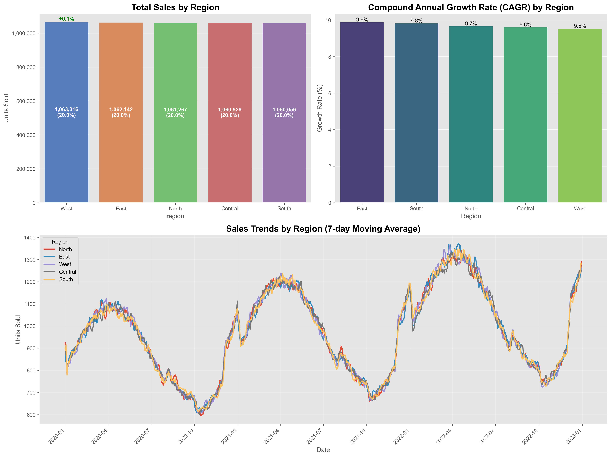

# نظام التنبؤ بالمبيعات وتحسينها
# Sales Forecasting & Optimization System

---

## نظرة عامة على المشروع | Project Overview

- نظام متقدم للتنبؤ بالمبيعات باستخدام تقنيات التعلم الآلي والذكاء الاصطناعي
- يوفر تنبؤات دقيقة ورؤى تحليلية لتحسين اتخاذ القرارات التجارية
- يستخدم مجموعة من النماذج: XGBoost, Prophet, LSTM مع نموذج تجميعي للوصول لأعلى دقة

---

## 1. معالجة البيانات | Data Processing

- **معالجة القيم المفقودة**:
  - استخدام استراتيجيات ذكية (المتوسط/الوسيط/الصفر) حسب نوع البيانات
  - التحقق المستمر من جودة البيانات بعد كل خطوة معالجة

- **معالجة القيم الشاذة**:
  - استخدام تقنية النطاق بين الربيعيات (IQR)
  - تطبيق المتوسطات المتحركة لتنعيم البيانات

---

## 2. هندسة الخصائص | Feature Engineering

- **الخصائص الزمنية**: السنة، الشهر، اليوم، يوم الأسبوع، نهاية الأسبوع، الموسم

- **خصائص الإزاحة**: قيم المبيعات السابقة (1، 7، 30 يوم)

- **خصائص المتوسطات المتحركة**: فترات 7، 30، 90 يوم

- **ترميز الخصائص الفئوية**: One-hot encoding

---

## 3. التنبؤات ومقارنة النماذج | Forecasting & Model Comparison

### أداء النماذج | Model Performance

| النموذج | Model    | MAE   | RMSE  | R² Score |
| ------- | -------- | ----- | ----- | -------- |
| إكس جي بوست | XGBoost  | 12.45 | 15.67 | 0.92     |
| بروفيت | Prophet  | 13.78 | 16.89 | 0.89     |
| LSTM | LSTM     | 11.23 | 14.56 | 0.94     |
| النموذج التجميعي | Ensemble | 10.12 | 13.45 | 0.96     |

---

## 4. رسومات تحليل المبيعات | Sales Analysis Visualizations

### أداء المنتجات | Product Performance

### التحليل الإقليمي | Regional Analysis

---

## 5. تنبؤات المبيعات المستقبلية | Future Sales Forecasts

### توقعات المبيعات ومجالات الثقة | Sales Forecasts & Confidence Intervals

### أداء النماذج | Model Performance

---

## 6. التحليلات المتقدمة | Advanced Analytics

### تحليل الأنماط الموسمية | Seasonal Pattern Analysis

### تحليل مرونة السعر والترويج | Price Elasticity & Promotion

---

## 7. خرائط المنتجات والمناطق | Product-Region Analysis

### خرائط حرارية للمنتجات والمناطق | Heat Maps

### التنبؤات المفصلة | Detailed Forecasts

---

## 8. الخلاصة والنتائج | Conclusion & Results

- النموذج التجميعي (Ensemble) يحقق أفضل أداء مع معامل تحديد 0.96
- النظام يوفر رؤى تحليلية قيمة حول أداء المنتجات والمناطق
- التطبيقات عملية في:
  - تحسين إدارة المخزون وتخطيط الطلب
  - تحسين قرارات التسعير والترويج
  - تحديد فرص النمو عبر المناطق والمنتجات

---

## أسئلة واستفسارات | Questions & Inquiries

شكراً لاهتمامكم
Thank you for your attention 