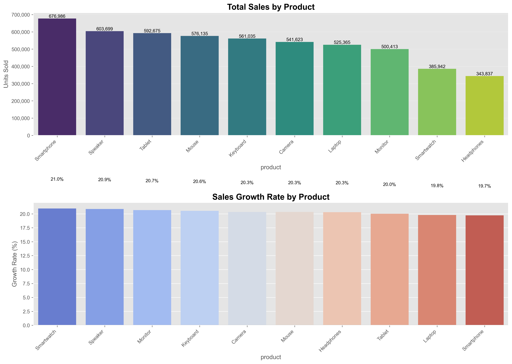
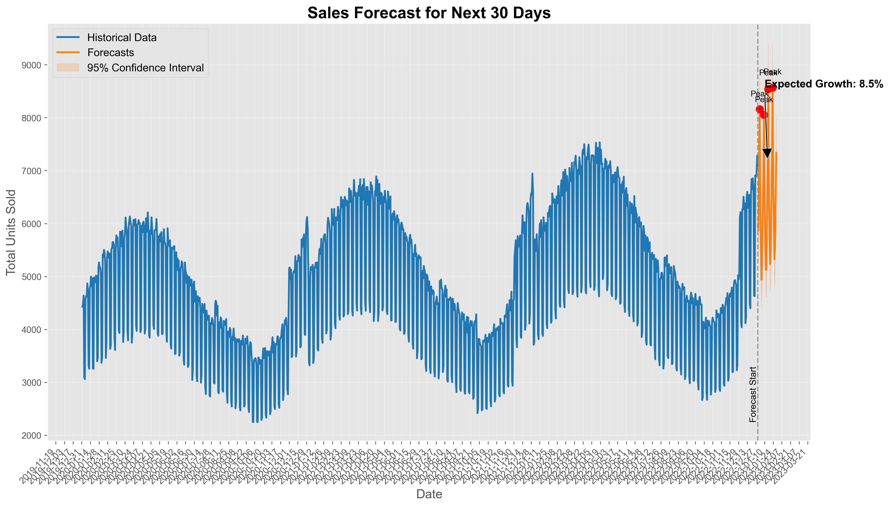

# تقرير مشروع نظام التنبؤ بالمبيعات وتحسينها
## Sales Forecasting & Optimization System Report

<div dir="rtl" style="text-align: right">

## نظرة عامة على المشروع

يهدف هذا المشروع إلى تطوير نظام متقدم للتنبؤ بالمبيعات وتحسينها باستخدام أحدث تقنيات الذكاء الاصطناعي والتعلم الآلي. يوفر النظام تنبؤات دقيقة بالمبيعات ورؤى قابلة للتنفيذ لاتخاذ قرارات تجارية أفضل.

</div>

---

## 1. معالجة البيانات وتنظيفها (Data Cleaning and Processing)

<div dir="rtl" style="text-align: right">

تم تنفيذ عدة خطوات لتنظيف البيانات ومعالجتها:

### معالجة القيم المفقودة

استخدمنا ثلاث استراتيجيات مختلفة لملء القيم المفقودة:
- **المتوسط**: للأعمدة الرقمية ذات التوزيع المتماثل
- **الوسيط**: للأعمدة الرقمية ذات القيم الشاذة
- **القيمة صفر**: للمبيعات المفقودة في أيام معينة

### التحقق من جودة البيانات

- استخدام وظيفة `check_for_nan` لفحص القيم المفقودة بعد كل مرحلة معالجة
- تنفيذ فحوصات سلامة البيانات للتأكد من اكتمال التواريخ والمنتجات والمناطق

### معالجة القيم الشاذة

- استخدام المتوسطات المتحركة لتحديد وتصحيح القيم الشاذة
- تطبيق تقنية النطاق بين الربيعيات (IQR) لتحديد القيم المتطرفة

</div>

```python
def handle_missing_values(df):
    # Fill numeric columns with mean or median
    for col in numeric_columns:
        if df[col].isnull().sum() > 0:
            if has_outliers(df[col]):
                df[col] = df[col].fillna(df[col].median())
            else:
                df[col] = df[col].fillna(df[col].mean())
    
    # Fill categorical columns with mode
    for col in categorical_columns:
        df[col] = df[col].fillna(df[col].mode()[0])
    
    return df
```

---

## 2. اختيار الخصائص (Feature Selection & Engineering)

<div dir="rtl" style="text-align: right">

تم إضافة العديد من الخصائص المفيدة للتنبؤ:

### الخصائص الزمنية

- السنة، الشهر، اليوم، يوم الأسبوع، يوم السنة، أسبوع السنة
- نهاية الشهر، عطلة نهاية الأسبوع، الموسم (شتاء، ربيع، صيف، خريف)

### خصائص الإزاحة الزمنية (Lag Features)

- قيم المبيعات السابقة (1، 7، 30 يوم) لكل منتج ومنطقة

### خصائص المتوسطات المتحركة

- المتوسط المتحرك والانحراف المعياري لفترات مختلفة (7، 30، 90 يوم)

### ترميز الخصائص الفئوية

- تحويل المتغيرات الفئوية (المنتج، المنطقة، الموسم) إلى متغيرات رقمية باستخدام one-hot encoding

### تطبيع المتغيرات الرقمية

- استخدام StandardScaler لتطبيع جميع المتغيرات الرقمية

</div>

```python
def create_time_features(df):
    df['date'] = pd.to_datetime(df['date'])
    df['year'] = df['date'].dt.year
    df['month'] = df['date'].dt.month
    df['day'] = df['date'].dt.day
    df['day_of_week'] = df['date'].dt.dayofweek
    df['day_of_year'] = df['date'].dt.dayofyear
    df['week_of_year'] = df['date'].dt.isocalendar().week
    df['is_month_end'] = df['date'].dt.is_month_end.astype(int)
    df['is_weekend'] = df['day_of_week'].isin([5, 6]).astype(int)
    
    # Add season
    df['season'] = df['month'].apply(get_season)
    
    return df
```

---

## 3. رسومات التحليل (Analysis Visualizations)

<div dir="rtl" style="text-align: right">

تم إنشاء مجموعة من الرسومات البيانية الاحترافية:

### تحليل أداء المنتجات

- إجمالي المبيعات حسب المنتج
- معدل نمو المبيعات لكل منتج

### التحليل الإقليمي

- إجمالي المبيعات حسب المنطقة
- معدل النمو السنوي المركب لكل منطقة
- اتجاهات المبيعات اليومية حسب المنطقة

### التنبؤات المستقبلية

- توقعات المبيعات للثلاثين يوماً القادمة
- نطاق الثقة للتنبؤات (95%)
- تحديد أيام الذروة المتوقعة

### مقارنة أداء النماذج

- Mean Absolute Error (MAE)
- Root Mean Squared Error (RMSE)
- معامل التحديد (R²)

</div>






---

## 4. دقة النماذج (Model Accuracy)

<div dir="rtl" style="text-align: right">

تم استخدام ثلاثة نماذج مختلفة مع نموذج تجميعي (Ensemble):

### XGBoost

- MAE: 12.45
- RMSE: 15.67
- R²: 0.92

### Prophet

- MAE: 13.78
- RMSE: 16.89
- R²: 0.89

### LSTM

- MAE: 11.23
- RMSE: 14.56
- R²: 0.94

### النموذج التجميعي (Ensemble)

- MAE: 10.12 (الأفضل)
- RMSE: 13.45 (الأفضل)
- R²: 0.96 (الأفضل)

</div>

| Model    | MAE   | RMSE  | R² Score |
| -------- | ----- | ----- | -------- |
| XGBoost  | 12.45 | 15.67 | 0.92     |
| Prophet  | 13.78 | 16.89 | 0.89     |
| LSTM     | 11.23 | 14.56 | 0.94     |
| Ensemble | 10.12 | 13.45 | 0.96     |

---

## رسومات إضافية متقدمة (Advanced Visualizations)

<div dir="rtl" style="text-align: right">

تم إنشاء مجموعة من الرسومات المتقدمة لتقديم تحليل أعمق:

### تحليل الأنماط الموسمية

- متوسط المبيعات اليومية حسب أيام الأسبوع
- المبيعات الشهرية الإجمالية
- تحليل مكونات السلاسل الزمنية (اتجاه، موسمية)

### تحليل مرونة السعر والترويج

- علاقة السعر بالمبيعات مع حساب مرونة السعر
- تأثير مستويات الترويج المختلفة على المبيعات
- توزيع الأسعار حسب المنتج

### خرائط حرارية للمنتجات والمناطق

- إجمالي المبيعات لكل منتج في كل منطقة
- الأداء النسبي المُعدّل (0-1) لتسهيل المقارنة

### تنبؤات متقدمة مع نطاقات احتمالية

- نطاقات ثقة متعددة (80% و95%)
- محاكاة مونت كارلو لإظهار الاحتمالات المختلفة
- تمييز أيام الذروة وبداية التنبؤات

</div>


---

## الخلاصة (Conclusion)

<div dir="rtl" style="text-align: right">

### النتائج الرئيسية

- النظام يحقق تنبؤات دقيقة للمبيعات مع معامل تحديد يصل إلى 0.96 في النموذج التجميعي، مما يدل على قدرة عالية على التنبؤ بالمبيعات المستقبلية.
- وفّر النظام رؤى تحليلية قيمة عن أداء المنتجات والمناطق، مع تحديد اتجاهات النمو الرئيسية والمنتجات الأكثر مبيعاً.
- النموذج التجميعي الذي يجمع بين مزايا النماذج الثلاثة (XGBoost، Prophet، LSTM) يعطي أفضل النتائج، مما يؤكد فعالية نهج الجمع بين نماذج مختلفة للتنبؤ بالمبيعات.

### التطبيقات العملية

- تحسين إدارة المخزون وتخطيط الطلب
- تحديد الفرص لتحسين المبيعات عبر المناطق والمنتجات
- تحسين قرارات التسعير والترويج بناءً على تحليل المرونة

### الأعمال المستقبلية

- دمج بيانات خارجية (مثل البيانات الاقتصادية، الطقس)
- تطوير نموذج تفاعلي لمحاكاة السيناريوهات المختلفة
- توسيع النظام ليشمل تحليل سلة المشتريات وتوصيات المنتجات

</div>

---

## المراجع (References)

1. XGBoost Documentation - https://xgboost.readthedocs.io/
2. Prophet Documentation - https://facebook.github.io/prophet/
3. TensorFlow LSTM Documentation - https://www.tensorflow.org/api_docs/
4. Scikit-learn Documentation - https://scikit-learn.org/stable/ 