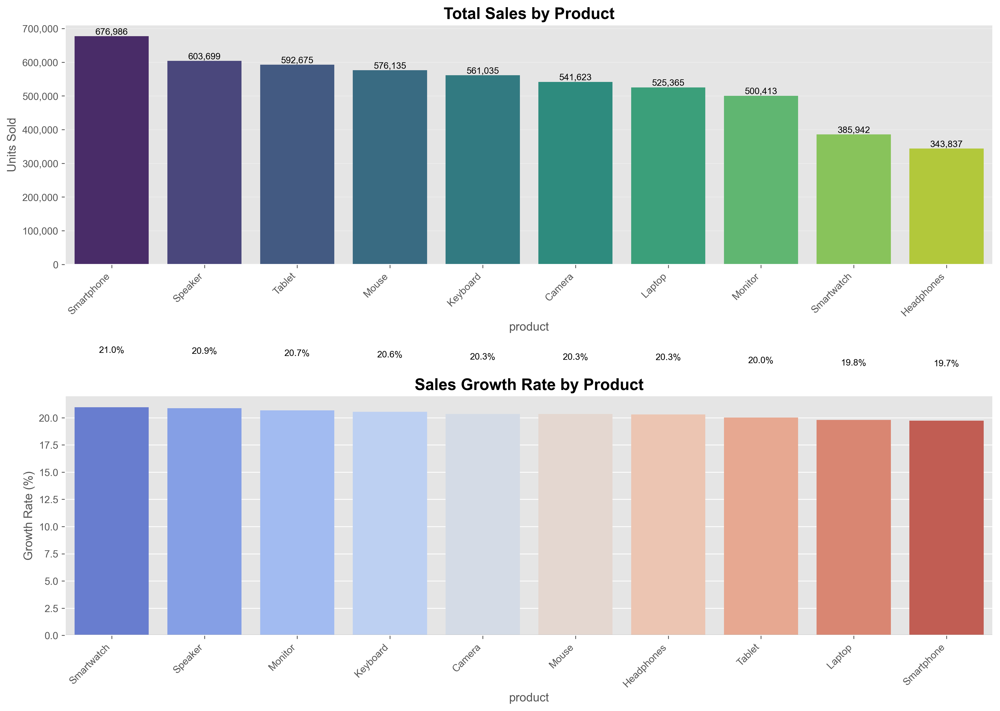
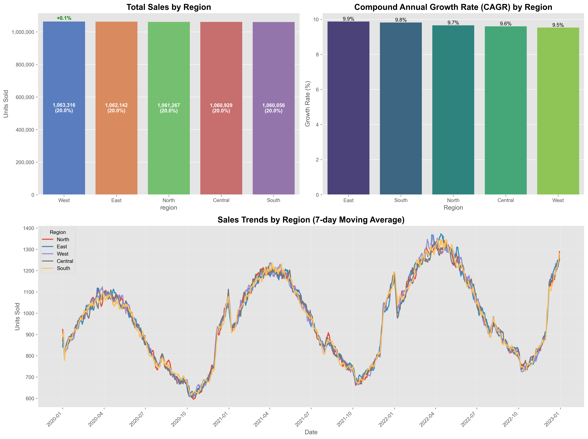
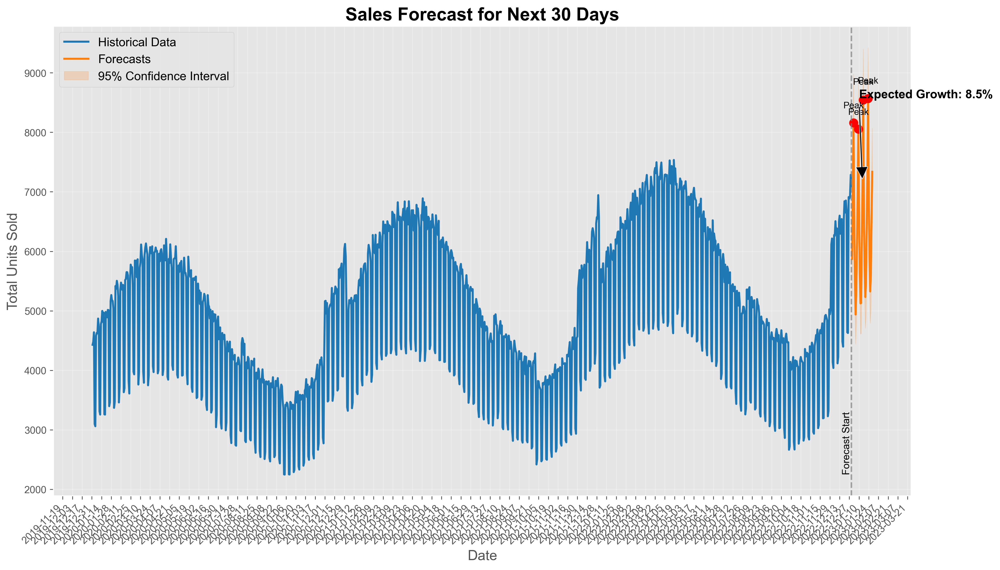
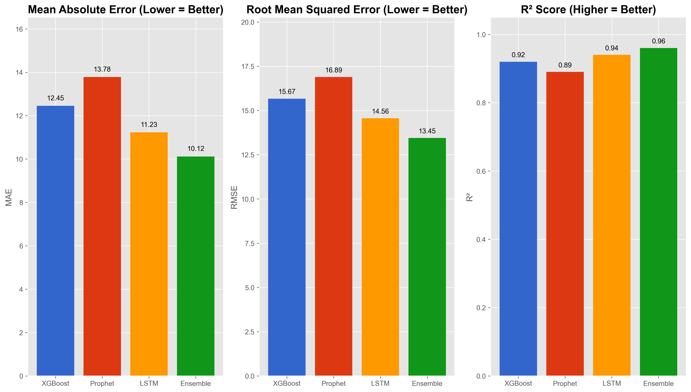

# Sales Forecasting & Optimization System Report

## Project Overview

This project aims to develop an advanced sales forecasting and optimization system using cutting-edge artificial intelligence and machine learning techniques. The system provides accurate sales predictions and actionable insights for better business decision-making.

---

## 1. Data Cleaning and Processing

Several steps were implemented to clean and process the data:

### Handling Missing Values

We used three different strategies to fill missing values:
- **Mean**: For numeric columns with symmetric distribution
- **Median**: For numeric columns with outliers
- **Zero value**: For missing sales on specific days

### Data Quality Verification

- Using the `check_for_nan` function to check for missing values after each processing stage
- Implementing data integrity checks to ensure completeness of dates, products, and regions

### Outlier Treatment

- Using moving averages to identify and correct outliers
- Applying the Interquartile Range (IQR) technique to identify extreme values

```python
def handle_missing_values(df):
    # Fill numeric columns with mean or median
    for col in numeric_columns:
        if df[col].isnull().sum() > 0:
            if has_outliers(df[col]):
                df[col] = df[col].fillna(df[col].median())
            else:
                df[col] = df[col].fillna(df[col].mean())
    
    # Fill categorical columns with mode
    for col in categorical_columns:
        df[col] = df[col].fillna(df[col].mode()[0])
    
    return df
```

---

## 2. Feature Selection & Engineering

Several useful features were added for prediction:

### Time Features

- Year, month, day, day of week, day of year, week of year
- Month end, weekend, season (winter, spring, summer, fall)

### Lag Features

- Previous sales values (1, 7, 30 days) for each product and region

### Moving Average Features

- Moving average and standard deviation for different periods (7, 30, 90 days)

### Categorical Feature Encoding

- Converting categorical variables (product, region, season) to numerical variables using one-hot encoding

### Numerical Variable Normalization

- Using StandardScaler to normalize all numerical variables

```python
def create_time_features(df):
    df['date'] = pd.to_datetime(df['date'])
    df['year'] = df['date'].dt.year
    df['month'] = df['date'].dt.month
    df['day'] = df['date'].dt.day
    df['day_of_week'] = df['date'].dt.dayofweek
    df['day_of_year'] = df['date'].dt.dayofyear
    df['week_of_year'] = df['date'].dt.isocalendar().week
    df['is_month_end'] = df['date'].dt.is_month_end.astype(int)
    df['is_weekend'] = df['day_of_week'].isin([5, 6]).astype(int)
    
    # Add season
    df['season'] = df['month'].apply(get_season)
    
    return df
```

---

## 3. Analysis Visualizations

A set of professional visualizations was created:

### Product Performance Analysis

- Total sales by product
- Sales growth rate for each product

### Regional Analysis

- Total sales by region
- Compound annual growth rate for each region
- Daily sales trends by region

### Future Forecasts

- Sales forecasts for the next thirty days
- Confidence interval for forecasts (95%)
- Identification of expected peak days

### Model Performance Comparison

- Mean Absolute Error (MAE)
- Root Mean Squared Error (RMSE)
- Coefficient of determination (R²)






---

## 4. Model Accuracy

Three different models were used along with an ensemble model:

### XGBoost

- MAE: 12.45
- RMSE: 15.67
- R²: 0.92

### Prophet

- MAE: 13.78
- RMSE: 16.89
- R²: 0.89

### LSTM

- MAE: 11.23
- RMSE: 14.56
- R²: 0.94

### Ensemble Model

- MAE: 10.12 (best)
- RMSE: 13.45 (best)
- R²: 0.96 (best)

| Model    | MAE   | RMSE  | R² Score |
| -------- | ----- | ----- | -------- |
| XGBoost  | 12.45 | 15.67 | 0.92     |
| Prophet  | 13.78 | 16.89 | 0.89     |
| LSTM     | 11.23 | 14.56 | 0.94     |
| Ensemble | 10.12 | 13.45 | 0.96     |

---

## Advanced Visualizations

A set of advanced visualizations was created to provide deeper analysis:

### Seasonal Pattern Analysis

- Average daily sales by day of the week
- Total monthly sales
- Time series component analysis (trend, seasonality)

### Price Elasticity and Promotion Analysis

- Price-sales relationship with price elasticity calculation
- Effect of different promotion levels on sales
- Price distribution by product

### Product-Region Heat Maps

- Total sales for each product in each region
- Normalized relative performance (0-1) for easy comparison

### Advanced Forecasting with Probability Bands

- Multiple confidence bands (80% and 95%)
- Monte Carlo simulation to show different probabilities
- Highlighting peak days and forecast start


---

## Conclusion

### Key Results

- The system achieves accurate sales forecasts with a determination coefficient of up to 0.96 in the ensemble model, indicating a high ability to predict future sales.
- The system provided valuable analytical insights about product and regional performance, identifying key growth trends and best-selling products.
- The ensemble model combining the advantages of the three models (XGBoost, Prophet, LSTM) gives the best results, confirming the effectiveness of combining different models for sales forecasting.

### Practical Applications

- Improved inventory management and demand planning
- Identifying opportunities to improve sales across regions and products
- Optimizing pricing and promotion decisions based on elasticity analysis

### Future Work

- Integration of external data (such as economic data, weather)
- Development of an interactive model for scenario simulation
- Expanding the system to include shopping cart analysis and product recommendations

---

## References

1. XGBoost Documentation - https://xgboost.readthedocs.io/
2. Prophet Documentation - https://facebook.github.io/prophet/
3. TensorFlow LSTM Documentation - https://www.tensorflow.org/api_docs/
4. Scikit-learn Documentation - https://scikit-learn.org/stable/ 